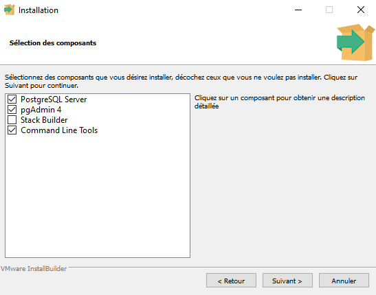
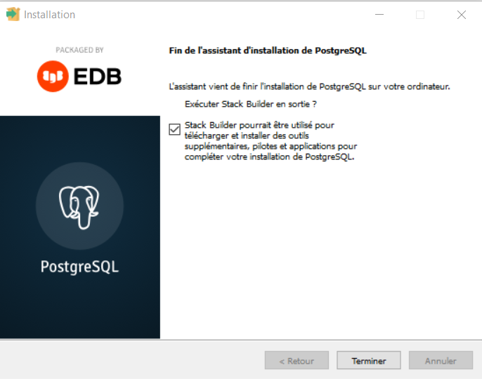
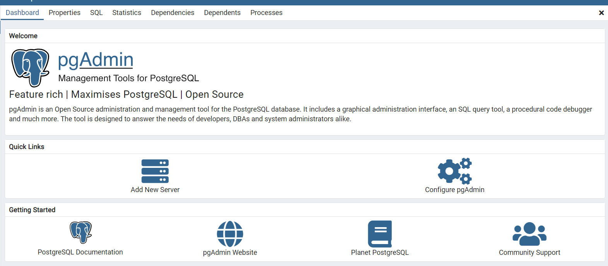
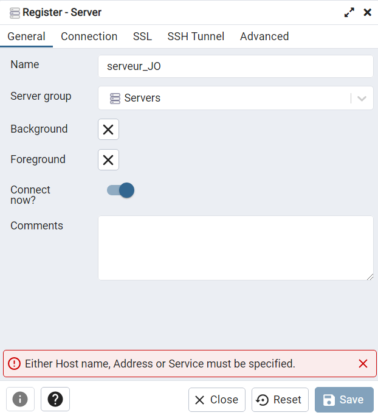
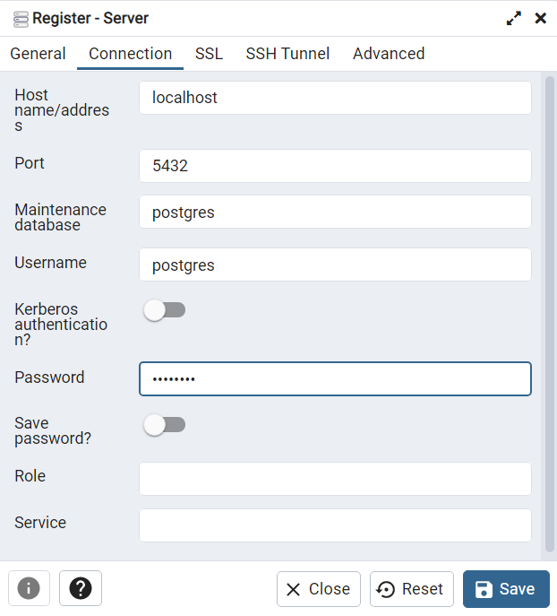
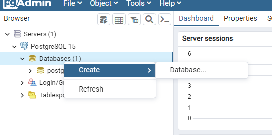
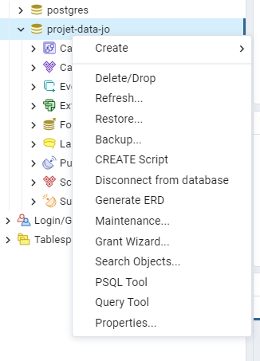
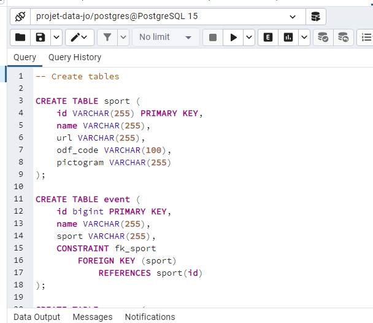

# Projet B3 DATA - L'évolution des Jeux Olympiques

Sur ce ReadMe vous trouverez les instructions pour mettre en place le projet afin de pouvoir lire le Notebook correctement.

## Création de la connexion à la base de données

Pour commencer, il vous faut un environnement postgreSQL comme par exemple pgAdmin que nous avons utilisé.

Pour commencer, il vous faudra installer PostgreSQL. Vous pourrez télécharger une version de PostgreSQL via ce lien : https://www.postgresql.org/download/ en veillant à choisir la version correspondant à votre système d'exploitation.

Lorsque le téléchargement est fini, lancez l'exécutable et suivez les étapes une par une. 
Sur la fenêtre demandant la sélection des composants, cochez tout :  

Ensuite continuez les étapes :
- Choix du répertoire de stockage des données
- Définition d'un mot de passe pour le super utilisateur
- Le choix du port (5432)
- La locale

Une fois l'installation faite, vous pouvez cliquer sur **Terminer** en laissant la case cochée :  

Lorsque c'est fait et que pgAdmin est lancé, allez sur la page Dashboard comme ceci : 
Sur cette interface, vous pouvez ajouter un serveur en cliquant sur le bouton **Add New Server** qui vous ouvre une fenêtre pour l'initialisation.
Entrez le nom que vous voulez pour le serveur comme par exemple 

Ensuite, dans l'onglet **Connection**, précisez les informations comme ceci : 

- Host name/adress : *localhost*
- Port : 5432
- Maintenance Database : postgres
- Username : postgres
- password : postgres
 
Ce qui donne ce résultat 

Ensuite, vous devez créer une base en faisant un clic droit puis "Create" 
**Nommez là "projet-data-jo"** 

Lorsqu'elle est créée, faites un clic droit dessus et ouvrez le Query Tool : 

Dedans vous allez pouvoir coller tout le texte du fichier 'init-db.sql' comme ceci puis l'exécuter :  

Ensuite, il vous faudra retourner sur les fichiers Python et exécuter les fichiers suivants :

 - countries-scrapping.py
 - editions-scrapping.py
 - sports-scrapping.py
 - events-scrapping.py
 - results-scrapping.py